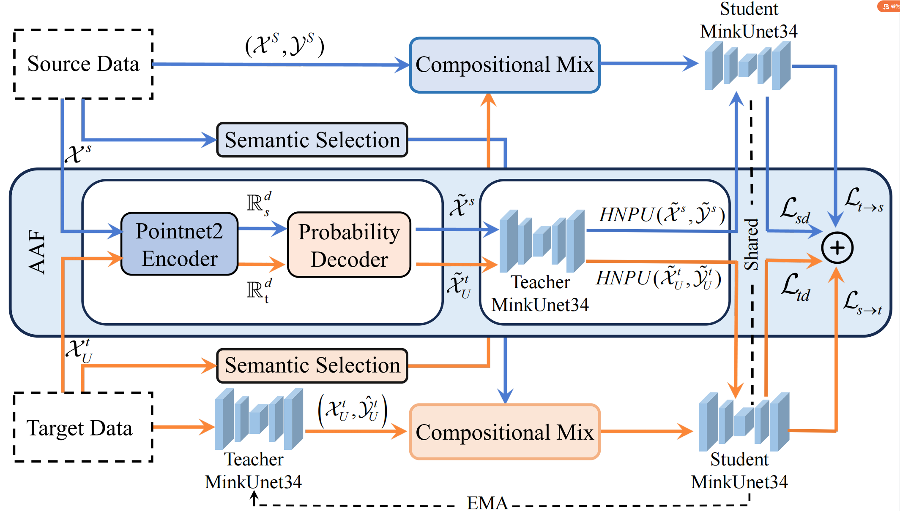

# Robust Unsupervised Domain Adaptation for 3D Point Cloud Segmentation Under Source Adversarial Attacks

**Code status:** 🚧 *Work in Progress.* We are actively organizing scripts, configs, and checkpoints. Interfaces may change.

## 1. Overview


This repository implements our RA-L work on **robust unsupervised domain adaptation (UDA) for 3D point cloud semantic segmentation when the source domain is adversarially corrupted**. We introduce:

- **AdvSynLiDAR**: an adversarial variant of SynLiDAR to simulate stealthy geometric/label corruption on the source domain.
- **AAF (Adversarial Adaptation Framework)** with two key components:
  1. **RLT Loss** for enhancing long-tailed class separability in 3D;
  2. **Probabilistic Decoder + HNPU** to refine geometry and update pseudo-labels via high-confidence neighborhood aggregation, used with a teacher–student consistency scheme.

We observe consistent mIoU gains over strong UDA baselines (e.g., CosMix/T-UDA) on **SynLiDAR → SemanticKITTI/SemanticPOSS** and **SemanticKITTI → nuScenes/Waymo**, even when the source is attacked.

---

## 2. Environment Setup

We follow a setup **similar to [CosMix-UDA](https://github.com/saltoricristiano/cosmix-uda)** to ease reproduction and fair comparisons. Make sure Torch/CUDA/MinkowskiEngine versions are mutually compatible.

**Recommended stack**

- Python ≥ 3.8
- PyTorch ≥ 1.10 (match your CUDA)
- MinkowskiEngine (built for your Torch/CUDA)
- Libraries: `numpy`, `scipy`, `open3d`, `tqdm`, `pyyaml`, `scikit-learn`, `wandb` (optional)

**Example (adjust versions to your system)**

```bash
conda create -n aaf3d python=3.10 -y
conda activate aaf3d

# Install torch matching your CUDA
pip install torch==2.2.1 torchvision==0.17.1 --index-url https://download.pytorch.org/whl/cu121

# MinkowskiEngine (build from source; ensure CUDA/Torch match)
pip install -U git+https://github.com/NVIDIA/MinkowskiEngine -v --no-deps

# Other deps
pip install numpy scipy open3d==0.17.0 tqdm pyyaml scikit-learn wandb
```

If MinkowskiEngine fails to compile, double-check CUDA/Torch versions and follow its README (CosMix-UDA’s notes are also helpful).

---

## 3. Data Preparation

We adopt the **same directory philosophy as CosMix-UDA**. Supported scenarios:

- **Synthetic → Real**: SynLiDAR → SemanticKITTI / SemanticPOSS
- **Real → Real**: SemanticKITTI → nuScenes-lidarseg / Waymo

**Suggested layout**

```css
data/
  SynLiDAR/
    points/ labels/ ...
  SemanticKITTI/
    sequences/ ...
  SemanticPOSS/
    sequences/ ...
  nuScenes_lidarseg/
    samples/ lidarseg/ ...
  Waymo/
    ... (converted to your expected format)

```

## 4. Training & Evaluation (examples; align with your actual scripts)

We are currently organizing our code, please wait patiently.

